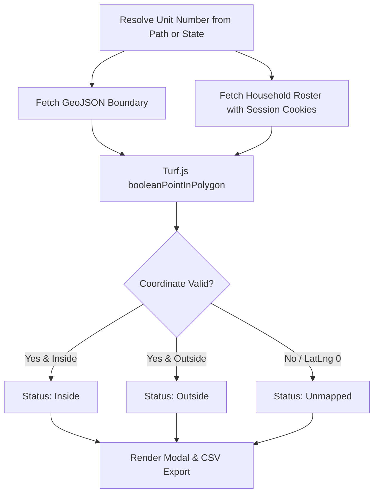

# Ward Boundary Audit (`membersOutsideBoundary`)

This action performs a client-side geometric audit of the ward directory to identify households located outside official unit boundaries.

---

## 1. User Experience

1. **Navigate**: Open the [Church Directory & Map](https://directory.churchofjesuschrist.org/) while signed in.
2. **Launch**: Click the LCR Tools extension icon and select **Ward Boundary Audit**.
3. **Analyze**: The extension resolves the current unit, fetches boundary polygons, and computes point-in-polygon status for each household.
4. **Review & Export**: An interactive modal displays:
   - Status summary cards (**Inside Boundary**, **Outside Boundary**, **Unmapped / Missing Coordinates**).
   - Filterable table of audited households.
   - **Download CSV** button protected with Church handbook data stewardship confirmation.

---

## 2. Technical Architecture

The module adheres strictly to the modular 4-file architecture defined in `AGENTS.md`:

- **`index.ts`**: High-level orchestration pipeline (`runMembersOutsideBoundary`).
- **`boundaryAuditHelper.ts`**: Boundary GeoJSON fetching, household extraction, and Turf.js spatial calculation.
- **`templates.ts`**: Semantic HTML templates for results modal and household cards.
- **`types.ts`**: Dot-indexed namespaces (`Types`, `Constants`, `Regex`, `Dom`) with strict individual JSDoc comments.
- **`utils.ts`**: Re-exports shared utilities with action-specific bindings.

---

## 3. Spatial Processing Pipeline

### Advantages over Legacy Canvas Implementation

1. **Precision & Speed**: Uses Turf.js vector polygon intersection rather than bitmap canvas pixel readbacks and alpha thresholding.
2. **Tri-State Reporting**: Gracefully categorizes members with missing or invalid geocoordinates as `unmapped` instead of misclassifying them as outside.
3. **Direct Session Fetch**: Queries Church Directory REST APIs directly with ambient session cookies rather than monkey-patching `window.fetch` on full page reloads.
4. **Formula Injection Defense**: All CSV exported fields are sanitized against spreadsheet formula injection attacks (`=`, `+`, `-`, `@`).

---

## 4. Privacy & Ecclesiastical Compliance

- **No Remote Telemetry**: All geometry math executes client-side in browser memory.
- **Calling-Gated**: Requires an authenticated Church Directory session with unit leadership access.
- **Handbook Alignment**: Fully documented in `JUSTIFICATION.md` under General Handbook Sections 33.8 and 38.8.31.
