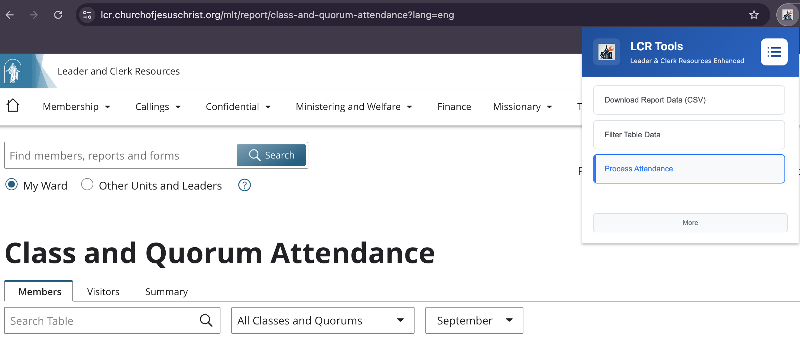
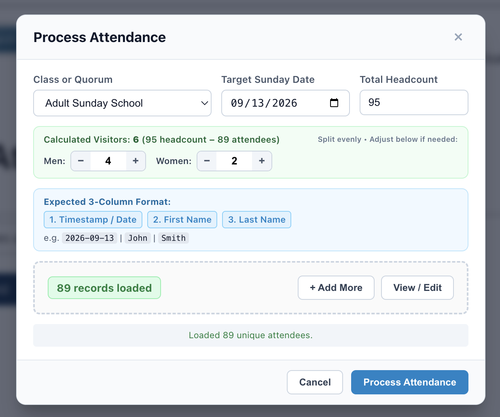
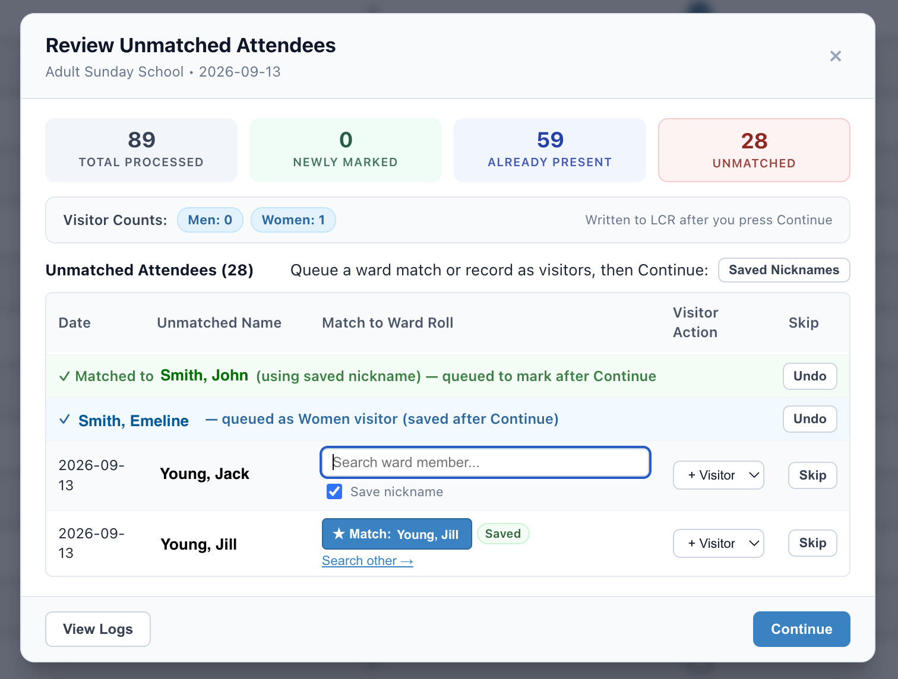
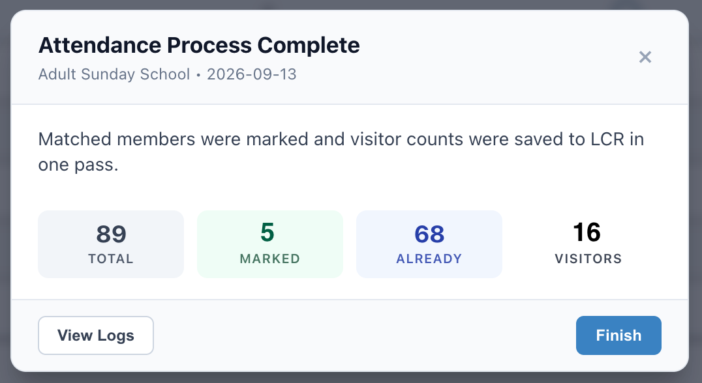

# Process Attendance

Helps Sunday School and Quorum secretaries turn a pasted attendance roster into accurate LCR marks—with a human review step for unmatched names and a single visitor write at the end.



---

## What this does

If you keep class or quorum attendance outside LCR (spreadsheet, Google Form export, clipboard paste), this action:

1. Lets you choose the class, Sunday, and overall headcount.
2. Auto-marks ward members it can confidently match on the LCR roll.
3. Shows everyone it could not match so you can link them to a member, queue them as visitors, or skip.
4. After you press **Continue**, marks any queued matches (A–Z) and saves visitor counts to LCR **once**.
5. Shows a completion summary with optional audit logs.

All work stays in your browser on Church LCR pages. Rosters and nickname shortcuts are not uploaded to any LCR Tools server.

---

## Who it is for

- Sunday School secretaries and teachers recording class attendance
- Elders Quorum / Relief Society / youth quorum secretaries entering weekly attendance
- Anyone with LCR access who already has a name list for that meeting

---

## How to use

### Before you start

1. Sign in to [Leader and Clerk Resources (LCR)](https://lcr.churchofjesuschrist.org/) and open the attendance page for your unit.
2. Have your roster ready as three columns: **Date**, **First Name**, **Last Name** (spreadsheet copy/paste works).

### Steps

1. Run **Process Attendance** from the LCR Tools popup (or directory) while on the attendance page.
2. In the **setup** modal:
   - Select the class or quorum.
   - Confirm the Sunday date.
   - Paste your roster.
   - Optionally enter total headcount so visitor counts can be estimated.

   

3. Click **Process Attendance** (or **Simulate Attendance** in developer simulation mode).
4. Wait while matched members are marked on the Members roll.
5. In the **Review Unmatched** modal:
   - Match leftover names to the ward roll (optional “remember nickname”).
   - Or mark someone as a visitor category.
   - Or skip.
   - Visitor chips are a preview only—they are not written to LCR yet.

   

6. Press **Continue**.
7. Wait while queued matches are marked and visitors are saved once.
8. On **Attendance Process Complete**, open **View Logs** if you want an audit trail, then **Finish**.

   

### Tips

- A paste that includes a header row is fine; the header is ignored.
- Every row in the date column must be the same meeting date (different timestamps on that day are fine).
- Nicknames (e.g. “Jon” → “Smith, Jonathan”) are stored only on this device and never auto-apply during the first auto-mark pass—you confirm them in review.
- Press **Esc** during marking to abort safely.

---

## End-to-end flow

```mermaid
flowchart LR
  setup["Setup modal (CSV + headcount)"]
  sync["Sync LCR (Members / month / class / Sunday)"]
  autoMark["Auto-mark matched names (A–Z)"]
  review["Review unmatched (queue matches and visitors)"]
  continueBtn[Continue]
  batchMark["Mark queued matches (A–Z)"]
  visitors["Write visitor counts once"]
  done["Completion (View Logs / Finish)"]
  setup --> sync --> autoMark --> review --> continueBtn
  continueBtn --> batchMark --> visitors --> done
```



Simulation mode follows the same modals. The visitor probe runs **after** Continue on **that Sunday’s** field: enter `1` → save → re-find the live field → write the **original** value back (blank or prior) → save → verify restore.

---

## Privacy and Handbook alignment

This action is documented in the repo’s justification matrix:

- [JUSTIFICATION.md — §2.6 `processAttendance`](../../../JUSTIFICATION.md)

Relevant Church guidance:

- [General Handbook — 33. Records and Reports](https://www.churchofjesuschrist.org/study/manual/general-handbook/33-records-and-reports?lang=eng) (confidentiality of records, including **33.8**)
- [General Handbook — 38. Church Policies and Guidelines](https://www.churchofjesuschrist.org/study/manual/general-handbook/38-church-policies-and-guidelines?lang=eng) (member privacy, including **38.8.31**)
- Live attendance updates occur only on Church LCR hosts (for example `lcr.churchofjesuschrist.org`)

Design commitments:

- No external telemetry or cloud sync of member names
- Nickname maps stay in extension `browser.storage.local`
- Human confirmation before nickname-driven and unmatched-review marks
- One visitor write after review—not repeated mid-run updates

Also see [PRIVACY_POLICY.md](../../../PRIVACY_POLICY.md).

---

## Safeguards (technical)

| Safeguard             | Behavior                                                                                  |
| --------------------- | ----------------------------------------------------------------------------------------- |
| DOM pre-verification  | Aborts with the shared LCR maintenance modal if expected tabs/tables/controls are missing |
| Esc abort             | Cancels in-flight marking / sync loops without leaving orphan overlays when possible      |
| Deferred review marks | Unmatched “Match” queues intent; LCR clicks happen only after Continue                    |
| Single visitor write  | `processClassVisitorCounts` runs once post-Continue                                       |
| Audit log             | Every navigate/select/click/match/visitor/skip can be reviewed and exported as CSV        |
| Nickname stewardship  | View or remove mappings from in-page **Saved Nicknames**, or **More → Manage Aliases**    |
| Synthetic tests       | Vitest fixtures use fake names only—never real member PII                                 |

---

## Code layout

```text
processAttendance/
├── index.ts                 Orchestration (setup → auto-mark → review → batch → completion)
├── types.ts / dom.ts        Action Types, Constants, Regex, Dom
├── templates/               Modal/row HTML (setup, review, completion, nicknames, logs, styles)
├── utils.ts                 Matching, abort, logging helpers
├── setup/                   Setup modal, paste parse, class options, edit view
├── lcr/                     Sync tabs/dropdowns, roll scan, mark present, visitors
├── members/                 Auto-mark loop + simulation dry-run
└── results/                 reviewHelper, unmatched table, nicknames, logs, completion
```

Church UI selectors for attendance live in `dom.ts` only. Prefer state waits (`waitForCondition`) over fixed sleeps on the live path.

---

## Simulation / developer notes

- Enable simulation from the extension popup **More** page (Developer Tools) or by calling `runProcessAttendance({ isSimulation: true })`.
- Member simulation scrolls the roll and toggles one attendance button on/off; it does not leave the roll marked.
- Visitor simulation must leave the probed input **empty** after restore. It re-queries by `name` after save because LCR may remount inputs.
- Keep tests under `tests/actions/processAttendance*.test.ts` on synthetic DOM fixtures only.
